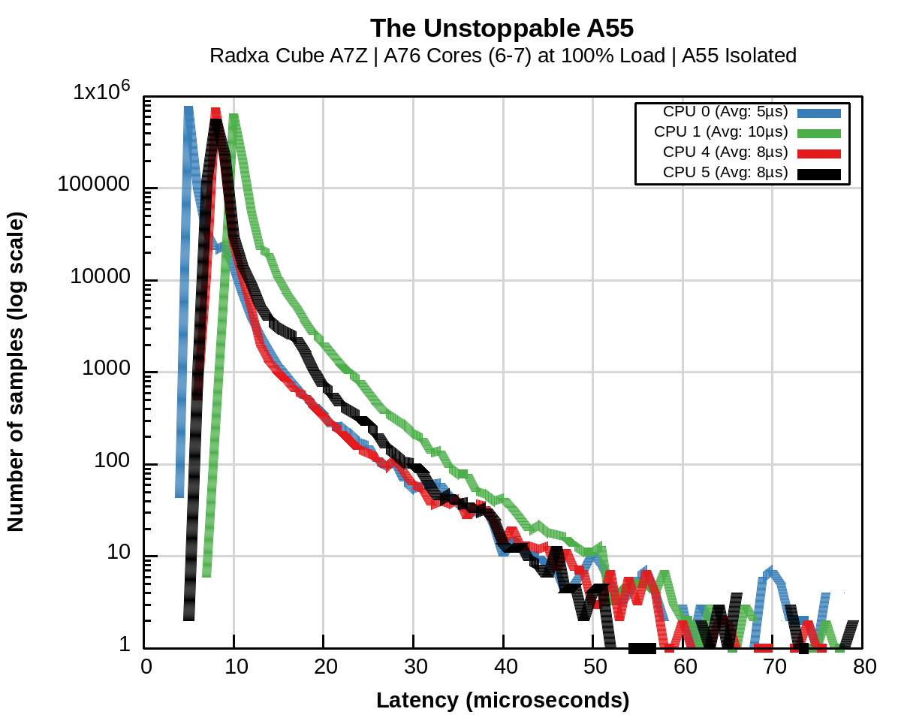
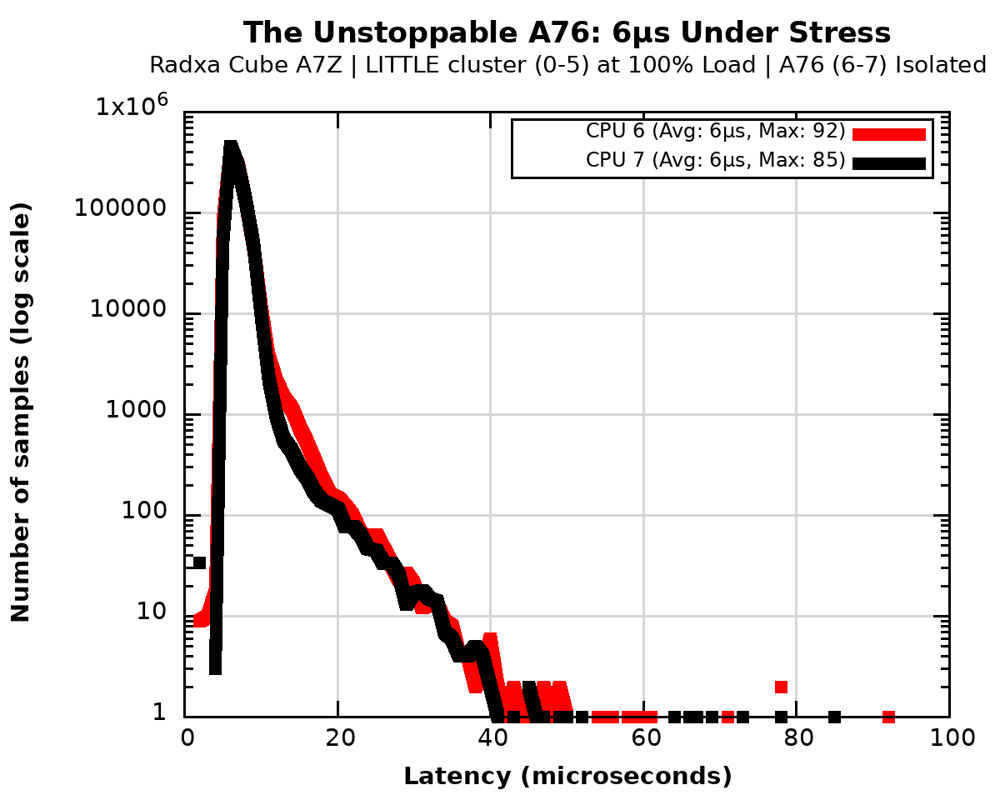

# Platform Deep-Dive: Allwinner A733 (Radxa Cube Zero A7Z)

The **Radxa Cube** is the technological flagship of this research. Its SoC, the **Allwinner A733**, features a powerful heterogeneous configuration:
*   **Big Cluster:** 2x Cortex-A76 (up to 2.0 GHz) — The high-precision RT engine.
*   **LITTLE Cluster:** 6x Cortex-A55 — The high-efficiency service cluster.

## 📊 Stage 1: "Vanilla Baseline" (Architectural Dominance)
*Objective: Observe the "Punctuality" of the A76 architecture in a stock 8-core SMP environment.*

### Raw Data (Baseline)

| Metric | LITTLE Cluster (6x A55) | Big Cluster (2x A76) 🏆 |
| :--- | :--- | :--- |
| **Min Latency** | 4 μs | **2 μs** |
| **Avg Latency** | 5 μs | **2 μs** |
| **Max Latency** | 19–50 μs | **13 μs** |
| **Overflows** | 0 | 0 |

**Observation:** The baseline results are unprecedented. The Cortex-A76 cores demonstrate an **Average Latency of 2 μs** out of the box. This is the "Physical Floor" of the ARMv8.2 pipeline, achieved even before deep surgical sterilization.

---

## 🔬 Stage 2: "Hardcore Stress" — Cluster Vulnerability Analysis

While the A76 cluster demonstrated absolute resilience, the **Cortex-A55** cluster (LITTLE) revealed the physical limits of energy-efficient architectures under extreme resource contention.

### Raw Data: A55 Cluster under "Noisy Neighbor" Attack
*   **Target Cores:** 6x Cortex-A55 (Isolated for RT)
*   **Service Cores:** 2x Cortex-A76 (Under `stress-ng` attack)
*   **Total Samples:** 6,000,000
*   **Avg Latency:** 7–10 μs
*   **Max Latency:** **740 μs (Critical Failure)**
*   **Overflows (>100 μs):** **14–25 events** per thread.

### 📈 Stress Visualization

### 🕵️ Evolutionary Comparison: Cortex-A53 vs. Cortex-A55

The comparison between the legacy **A53 (BCM2710/H618)** and the modern **A55 (A733 LITTLE cluster)** provides a unique insight into ARM's architectural evolution:

1.  **Baseline "Punctuality":** 
    *   **A53:** Starts at 15–22 μs (Avg). 
    *   **A55:** Starts at 5–7 μs (Avg). 
    *   *Conclusion:* The A55 is inherently twice as fast in interrupt entry due to the improved ARMv8.2-A pipeline and better GIC integration.

2.  **Stress Resilience:** 
    *   **A53:** Latency explodes to **228 μs** on the BCM2710.
    *   **A55:** Latency spikes even higher, reaching **740 μs** on the A733 under A76-driven stress.
    *   *Observation:* While the A55 is faster in "sterile" conditions, its **dependency on the shared system bus** and L3 cache makes it highly vulnerable when a "Big" neighbor (A76) saturates the interconnect.

3.  **The "L3 Cache Poisoning" Effect:** 
    *   The A55 cluster in the A733 SoC shares the DynamIQ Shared Unit (DSU). When the A76 cores generate massive memory traffic, the A55 cores suffer from **L3 cache eviction**, causing the catastrophic 740 μs spikes.

## 🧪 Scientific Verdict on A55
The Cortex-A55 is a significant upgrade over the A53 for **Soft RT** tasks, offering better average response times. However, for **Hard RT**, it remains unreliable under heavy bus load. In a SciOps-certified system (like the Radxa Cube), the A55 cluster must be used exclusively as a **"Service Shield"** to protect the A76 cores.

---

## 🔬 Stage 3: "Hardcore Stress" (The Resilience Masterclass)
*Objective: Verify the immunity of the A76 cluster while the A55 cluster is under 100% synthetic load.*

In this stage, we utilize the 6x A55 cores as a "service shield," absorbing all OS noise and `stress-ng` attacks, while the 2x A76 cores are dedicated solely to the RT-mission.

### Raw Data Comparison: A55 vs. A76 under Load

| Metric | LITTLE Cluster (6x A55) | Big Cluster (2x A76) 🏆 |
| :--- | :--- | :--- |
| **Min Latency** | 4–7 μs | **2 μs** |
| **Avg Latency** | 7–10 μs | **6 μs** |
| **Max Latency** | **740 μs (Critical Failure)** | **85–92 μs (Resilient)** |
| **Overflows** | **14–25 (Failed RT)** | **0 (Perfect Compliance)** |

### 📈 Stress Visualization

### 🕵️ Architectural Analysis: Why A76 Stays "Cold" Under Fire
The Radxa Cube's performance is a textbook case of architectural immunity. While the A55 cores suffered from massive latency spikes (up to 740 μs) due to memory bus saturation, the **A76 cores remained deterministic**:

1.  **GIC-600 & Advanced Interconnect:** The A733’s internal bus prioritization is exceptionally robust. The Big cores have a "VIP-lane" to memory resources that remains open even when the LITTLE cluster is drowning in `stress-ng` traffic.
2.  **L3 Cache Guarding:** The 2MB L3 cache (exclusive to the Big cores or better partitioned) prevents "cache poisoning" from the service tasks running on the A55 cores.
3.  **Instruction Reordering:** The A76’s wide out-of-order window allows it to effectively hide minor bus stalls that cause the in-order A55 cores to halt completely.

## 🧪 Scientific Conclusion
The Allwinner A733 (Radxa Cube) is the **Absolute Record Holder** of the SciOpsLab study. It successfully erases the boundary between General Purpose Linux and specialized RTOS.

*   **Verdict:** Certified for **Ultra-Precision Robotics** and **Edge-AI Control**.
*   **Punctuality:** The drift between Idle (2 μs) and Stress (6 μs) is nearly negligible.
*   **Control Limit:** Referent determinism for cycles up to **100–200 kHz**.

---
### 🔗 Artifacts
*   **Kernel:** `6.6.99-rt58` (Custom Allwinner Build)
*   **Raw Logs:** [A733_Baseline.log](../../Artifacts/Logs/A733_Baseline.log) | [A733_A76_Stress.log](../../Artifacts/Logs/A733_A76_Stress.log)

[Back to Results](../Results.md)
