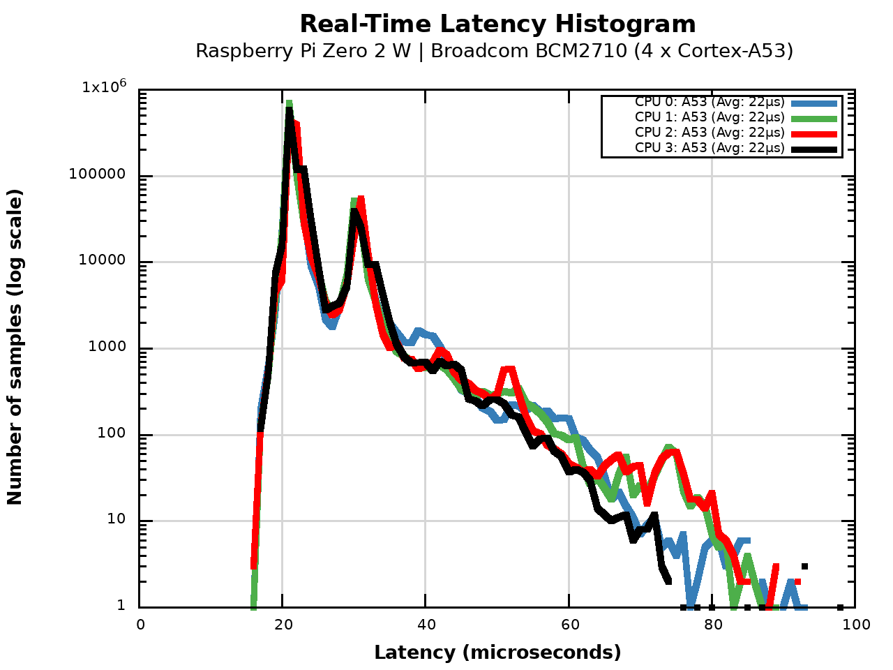
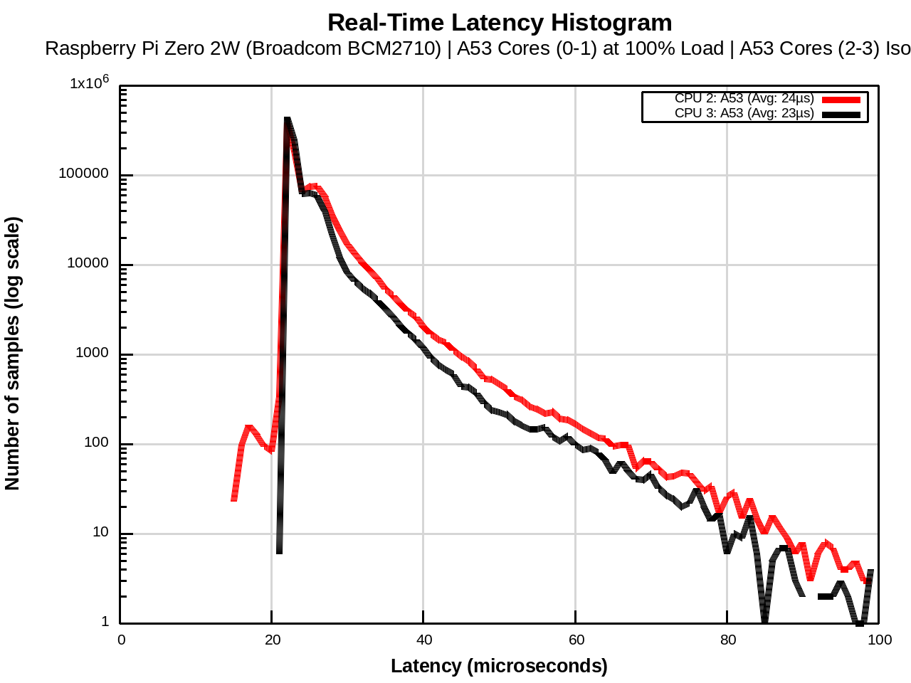

# Platform Deep-Dive: Broadcom BCM2710 (Raspberry Pi Zero 2 W)

In this research, the **Raspberry Pi Zero 2 W** serves as the **Control Group**. Featuring the classic Cortex-A53 architecture, it provides a baseline to evaluate the effectiveness of a "vanilla" `PREEMPT_RT` patch compared to the **RT-STALKER** sterilization methodology.

## 📊 Stage 1: "Vanilla Baseline" Analysis
*Objective: Measure the impact of stock scheduler behavior and C-states.*

### Observation
The "Vanilla" profile shows a significant **"Comb Effect"** (jitter smearing). While the average is 22 μs, the frequent spikes up to **122 μs** indicate that the system is prone to context-switching delays and power-management micro-pauses.

---

## 🔬 Stage 2 & 3: From Isolation to Hardcore Stress
*Objective: Identify the architectural limit and verify resilience under "Noisy Neighbor" attack.*

### Raw Data: Hardcore Stress (Stage 3)
*   **Threads Pinned:** 2 RT Threads (Isolated cores)
*   **Total Samples:** 2,000,000
*   **Min Latency:** 15 μs
*   **Avg Latency:** 23–24 μs
*   **Max Latency:** **228 μs** (Critical Failure)
*   **Overflows (>100 μs):** 41 total events detected.

### 📈 Stress Visualization

### 🕵️ Analysis of Failure
The Stage 3 results for BCM2710 are catastrophic for Hard RT applications:
1.  **Latency Explosion:** Despite core isolation, the **Max Latency jumped to 228 μs**. 
2.  **Bus Contention:** The A53 cores on this SoC share a limited internal bus and L2 cache. When `stress-ng` attacks the service cores, the memory bandwidth is saturated, causing the RT threads to stall while waiting for cache-line refills.
3.  **High Overflow Frequency:** 41 overflows in just 2 million cycles (compared to 0 on higher-end SoCs) prove that the isolation mechanisms on BCM2710 cannot fully shield the RT task from "Noisy Neighbor" interference.

## 🛠 Platform Specifics: BCM2710 Constraints
The Cortex-A53 is an in-order architecture. While power-efficient, its RT performance is hindered by:
*   **Shared Interconnect:** Limited throughput between the ARM cluster and the peripheral bus.
*   **L2 Cache Saturation:** Under stress, the service cores evict RT-critical data from the shared L2 cache.

## 🧪 Scientific Conclusion
The Raspberry Pi Zero 2 W **fails the Hard RT certification (70 μs threshold)** under load. 
*   **Verdict:** Suitable only for **Soft RT** or education. 
*   **Limit:** Control loops should not exceed **2–5 kHz** if any concurrent system activity is expected.

---
### 🔗 Artifacts
*   **Kernel:** `6.18.12-RT`
*   **Raw Log (Stress):** [bcm2710_stress.log](../../Artifacts/Logs/bcm2710_stress.log)

[Back to Results](../Results.md)
