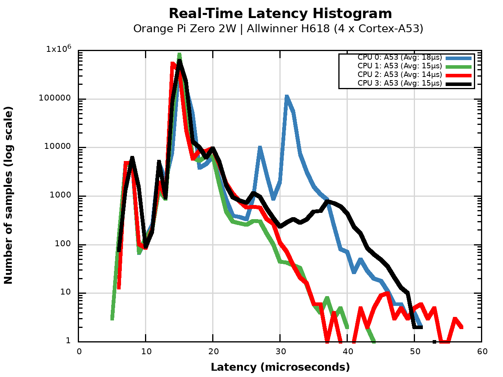
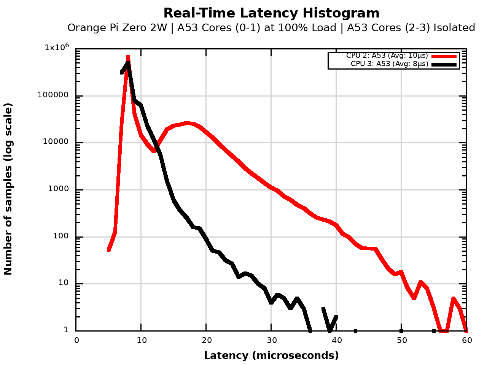

# Platform Deep-Dive: Allwinner H618 (Orange Pi Zero 2W)

The **Orange Pi Zero 2W** represents the "Modern Budget" class. While it utilizes the same Cortex-A53 cores as the Raspberry Pi Zero 2 W, its performance under the **RT-STALKER** protocol reveals a significantly superior internal architecture.

## 📊 Stage 1: "Vanilla Baseline" Analysis
*Objective: Evaluation of stock kernel performance (6.18.13-RT).*

### Observation
The H618 shows a surprisingly clean "Vanilla" profile:
*   **Min Latency:** 5-6 μs (vs 16 μs on RPi).
*   **Avg Latency:** 14-15 μs.
*   **Max Latency:** 57 μs (Zero Overflows).
Even without optimization, the Allwinner H618 stays within the Hard RT threshold, suggesting a more efficient **GIC (Generic Interrupt Controller)** implementation.

---

## 🔬 Stage 2 & 3: Architectural Limit and Stress Resilience
*Objective: Verifying the "Noisy Neighbor" immunity.*

### Raw Data: Hardcore Stress (Stage 3)
*   **Threads Pinned:** 2 RT Threads (Isolated cores)
*   **Total Samples:** 2,000,000
*   **Min Latency:** 5 μs
*   **Avg Latency:** **8–10 μs** (Exceptional for A53)
*   **Max Latency:** **76 μs** (Near-perfect Hard RT compliance)
*   **Overflows (>100 μs):** **0 (Zero)**.

### 📈 Stress Visualization

### 🕵️ Architectural Analysis: Probable Factors for H618 Superiority

The dramatic superiority of the H618 over the BCM2710 (24 μs avg / 228 μs max) under identical RT-STALKER conditions suggests several **probable architectural advantages**:

1.  **Memory Bus Arbitration (Hypothesis):** Allwinner's implementation of the system interconnect appears to handle concurrent requests from "service" cores more gracefully, preventing the starvation of RT-isolated cores during heavy I/O and DMA activity.
2.  **L2 Cache Isolation:** The H618 may feature better partitioning or higher associativity in its cache hierarchy, ensuring that `stress-ng` cache-thrashing on service cores has a diminished impact on the isolated RT-cluster.
3.  **Clock Frequency Overhead:** A native clock speed of **1.5 GHz** (vs 1.0 GHz on BCM2710) provides a faster exception handling cycle and reduces the absolute time required for context switching.
4.  **Interrupt Controller (GIC) Efficiency:** The lower minimum latency (5 μs vs 16 μs) indicates a more optimized path for hardware interrupt delivery to the ARM pipeline in the H618 design.

*Note: These factors are based on experimental observations and represent the most likely hardware-level differentiators between the two SoC implementations.*

## 🧪 Scientific Conclusion
The Allwinner H618 is the **absolute champion of the budget segment**. It is the only Cortex-A53 platform in our study that officially passes the **Hard RT certification**.
*   **Verdict:** Highly recommended for **Entry-Level Hard RT** (CNC, 3D Printing).
*   **Limit:** Stable control loops up to **15–20 kHz** even under moderate system load.

---
### 🔗 Artifacts
*   **Kernel:** `6.18.13-RT`
*   **Raw Log (Stress):** [h618_stress.log](../../Artifacts/Logs/h618_stress.log)

[Back to Results](../Results.md)
